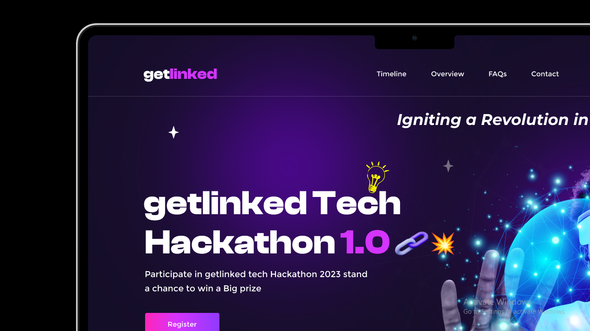

# Project Name: getLinked Landing Page



## Description

This project is a response to the Twitter challenge presented by getLinked.ai. The challenge involved designing and implementing a landing page for the startup called "getLinked." The landing page is aimed at connecting fellow developers, enabling them to interact, create teams for product development, find work opportunities, and more. The project was developed using React, Tailwind CSS, the Fetch API for API integration, React Router for routing, and Vite for the development environment. Additionally, ChatGPT was used for code optimization to enhance the project's overall quality.


## Table of Contents

- [Project Name: getLinked Landing Page](#project-name-getlinked-landing-page)
  - [Description](#description)
  - [Table of Contents](#table-of-contents)
  - [Features](#features)
  - [Technologies Used](#technologies-used)
  - [Installation](#installation)
  - [Usage](#usage)
  - [API Integration](#api-integration)
  - [Contributing](#contributing)
  - [License](#license)
  - [Acknowledgments](#acknowledgments)

## Features

- **User Registration**: Users can register on the platform using the provided API (register route).
- **Contact Us**: Users can get in touch with the team through the "Contact Us" feature, utilizing the contact route API.
- **Interactive UI**: The project implements a visually appealing and user-friendly UI based on the provided design.
- **Team Creation**: Users can create teams for collaborative product development.
- **Job Listings**: Developers can discover work opportunities posted on the platform.
- **Responsive Design**: The landing page is responsive and adapts to various screen sizes.

## Technologies Used

- **React**: Used as the primary frontend library to build the UI components.
- **Tailwind CSS**: Employed for styling the user interface, ensuring a clean and modern design.
- **Fetch API**: Used to connect the frontend with the backend APIs, enabling user registration and contact submission.
- **React Router**: Implemented for handling client-side routing within the application.
- **Vite**: Chosen as the development environment for its speed and efficiency.
- **ChatGPT**: Utilized for code optimization and enhancing project quality.

## Installation

To run this project locally, follow these steps:

```bash
# Clone this repository to your local machine:
git clone https://github.com/your-thamesblanq/getLinked-landing-page.git

# Navigate to the project directory:
cd getLinked-landing-page

# Install the project dependencies:
npm install

# Start the development server:
npm run dev

Open your web browser and visit http://localhost:3000 to view the getLinked landing page.
```

## Usage

- Register as a user on the platform to access additional features.
- Explore the various sections of the landing page to learn more about getLinked and its offerings.
- Create teams for collaborative product development.
- Browse job listings to discover work opportunities.
- Use the "Contact Us" feature to get in touch with the getLinked team.

## API Integration

**This project integrates with two APIs provided by getLinked.ai:**

- Register Route: Users can register on the platform using this API.
- Contact Route: The "Contact Us" feature utilizes this API to allow users to get in touch with the getLinked team.

## Contributing

Contributions to this project are welcome. If you have ideas for improvements or bug fixes, please submit a pull request. For major changes, please open an issue first to discuss the proposed changes.

## License

This project is licensed under the MIT License. See the LICENSE file for details.

## Acknowledgments

- Thanks to getLinked.ai for organizing the challenge and providing the design and APIs.
- Special thanks to the developers and contributors who helped make this project a reality.
